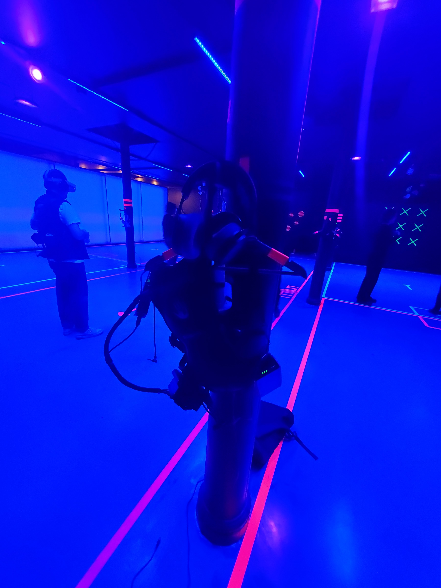

# Fiche d'oeuvre : Darren Emerson : In pursuit of repetive beats
## Lieu : Centre Phi | Date: 28/02/2024 | Realisation : Darren Emerson

*In pursuits of repetitive beats*

## Introduction
Dans l'oeuvre de Darren Emerson, on plonge dans l'univers du rêve au royaume-unis dans les anées 90. On accompagne un groupe de jeune adulte qui veulent rejoindre une raves illégale. Au même moment, on peux voir le jeux du chat et de la souris entre la police et les organisateurs de cette rave.

## Description

## Contexte de creation

## Analyse

## Appuis visuels

## Conclusion

