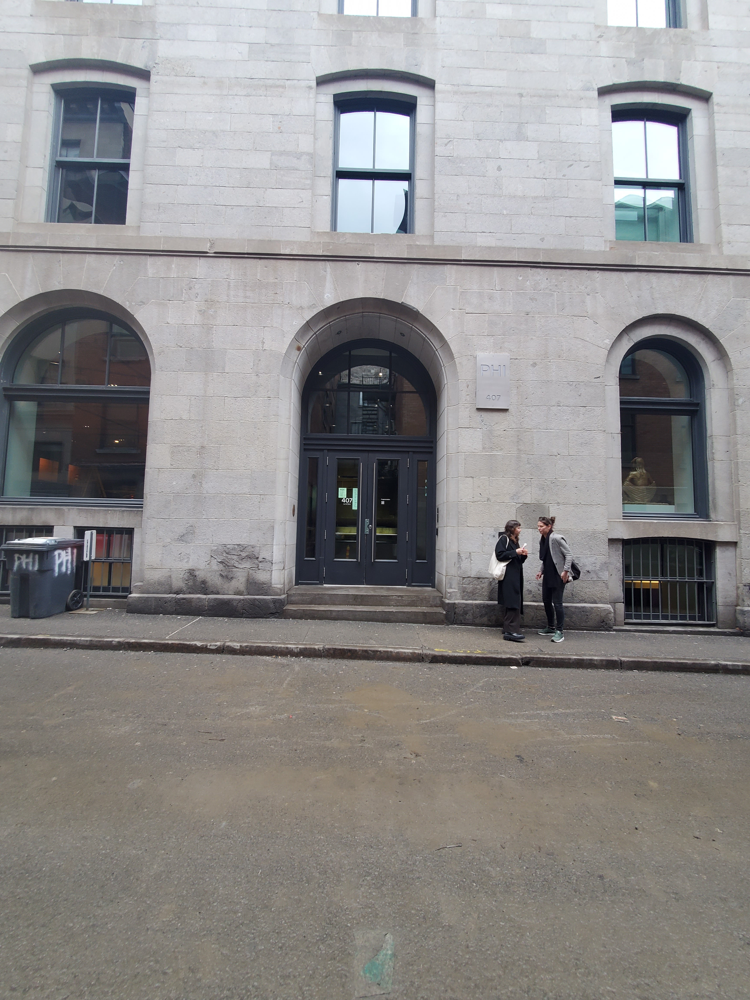

# Fiche d'oeuvre : Darren Emerson : In pursuit of repetive beats
## Lieu : Centre Phi | Date: 28/02/2024 | Realisation : Darren Emerson

*In pursuits of repetitive beats*

## Introduction
Dans l'oeuvre de Darren Emerson, on plonge dans l'univers du rêve au royaume-unis dans les anées 90. On accompagne un groupe de jeune adulte qui veulent rejoindre une raves illégale. Au même moment, on peux voir le jeux du chat et de la souris entre la police et les organisateurs de cette rave.

## Description

## Contexte de creation
Dans la création de l'oeuvre, on ils ont utiliser toute la technologie possible pour rendre ca le plus immersif possible. L'utilisation du casque VR avec mannetes (Oculus Quest 3), un casque audio, un gillet avec des moteurs pour la vibration et des fans pour rendre immersif la haute vitesse.

## Analyse

## Autres appuis visuels

## Conclusion
Dans cette exposition interactive, j'ai pû découvrir un côté du rave que j'avais jamais connu et le fait de le connaitre d'une autre culture et dans l'apogée rend l'experiance encore plus spécial.
