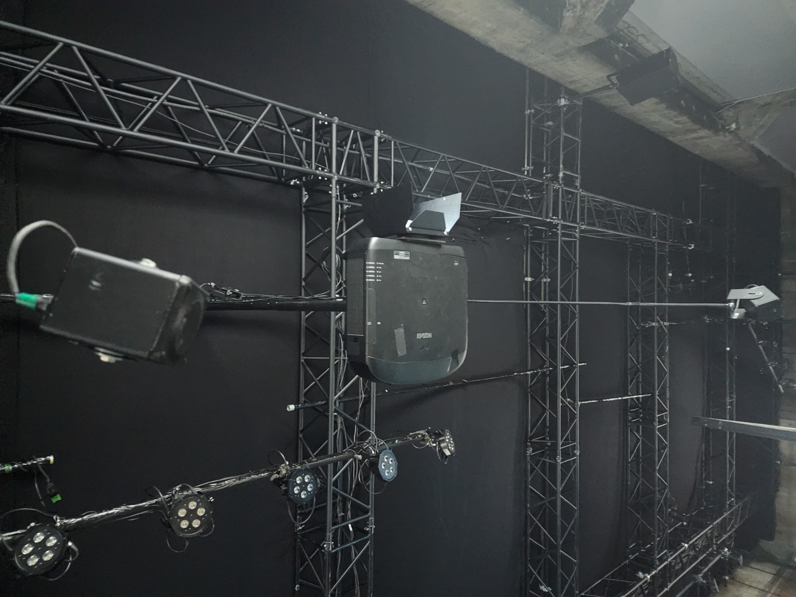
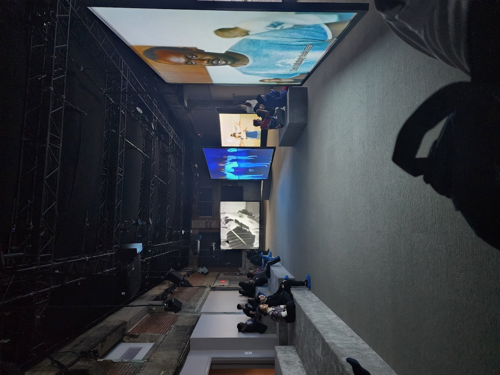
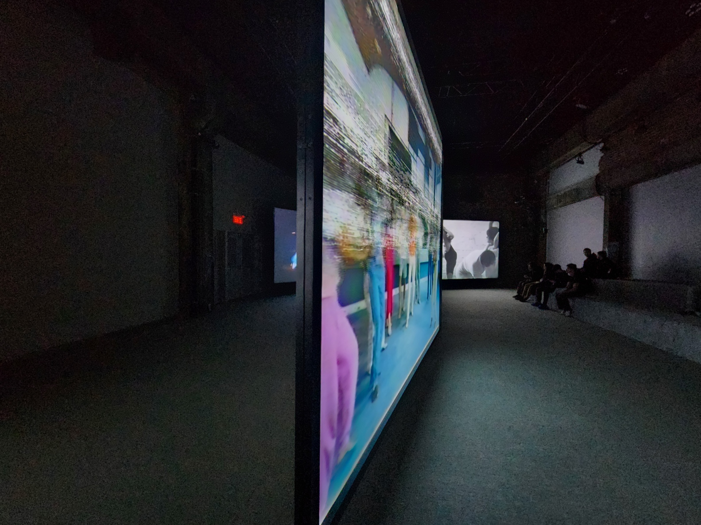
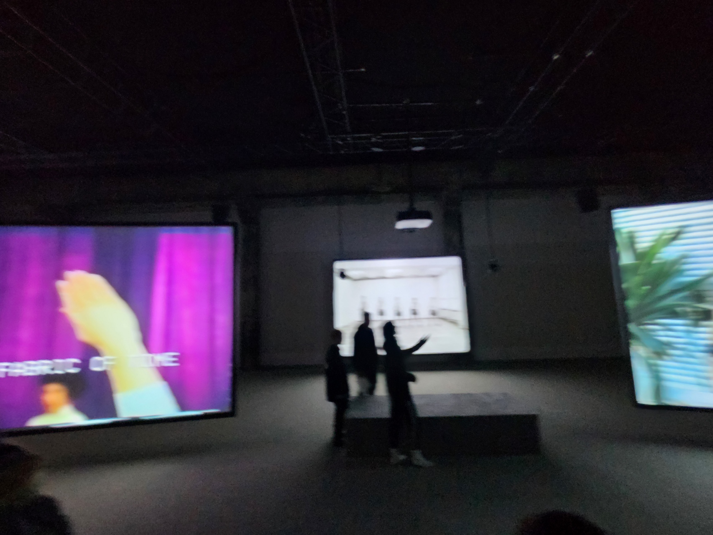

# fiche d'oeuvre : Jeremy Shaw: Phase Shifting Index
Lieu: Fonderie Darling | Date: 31/01/2024
realisation: The Polygon Gallery | 2020

*Phase Shifting Index* 

## Introduction

Jeremy Shaw met en avant une oeuvre immersive avec 7 cannaux different une mini series documentaire a propos une extase collective "transtemporelle" syncronisee.

## Description

L'oeuvre *Phase Shifting Index* fait le tour de 7 videos retrouver par des etres du futur qui essaye de comprendre notre vecu. Pour rendre tout cela immersif, on est dans un espace insonorise, avec le son vise dans une seul place et dans un confort total.

## Contexte de creation

Jeremy Shaw, nous montre plusieurs epoque avec un style de dance peux communs. Mais en allant toujours le meme narateur. Sa nous donne l'impressions qu'on est un observateur d'une epoque disparue. Plus l'oeuvre defilait, on pouvait voir que ses videos oublier racontait la meme histoire.

## Analyse

Ce que j'ai pu trouver dans cette oeuvre est que l'humains quand il arrive dans un niveau d'extase collective avec la dance. Il peux traverser le mur du temp et peux rejoindre d'autre personne qu'on peux appeler en mode "Transtemporelle" 

## Appuis visuels

 

 

 

## Conclusions

Ce que je peux conclure avec l'oeuvre *Phase Shiftig Index* sa mets en perspective que meme si tout cela se retrouve en 7 epoque differents, tout est relie quand l'humains est dans un niveau d'extase. Ils se retrouve dans un moment de "Transandance".
